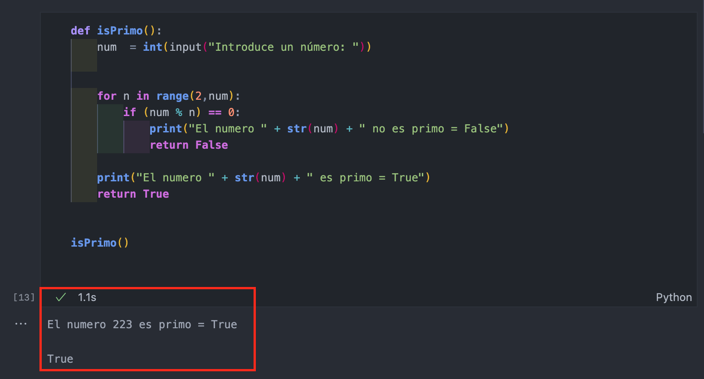
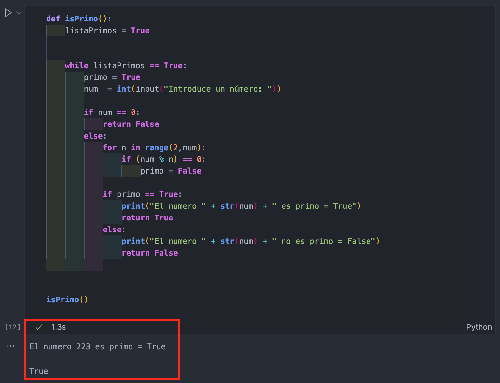

# Práctica 6 - Ejercicios funciones,procedimientos, cadenas y diccionarios.

**Escribe un programa que pida un texto por pantalla, este texto lo pase como parámetro a un procedimiento, y éste lo imprima primero todo en minúsculas y luego todo en mayúsculas.**

El archivo que contiene estafunción se llama ``` textos ```.


**Escribe un programa que lea (entrada por teclado) el nombre y los dos apellidos de una persona (en tres cadenas de caracteres diferentes), los pase como parámetros a una función, y ésta debe unirlos y devolver una única cadena. La cadena final será imprimida por el programa por pantalla.**

El archivo que contiene estafunción se llama ``` nombre ```.


**Escribe un programa que lea (entrada por teclado) una frase, y la pase como parámetro a un procedimiento, y éste debe mostrar la frase con un carácter en cada línea.**

El archivo que contiene estafunción se llama ``` frase ```.


**Escribe un programa que pida una frase (entrada por teclado), y le pase como parámetro a una función dicha frase. La función debe sustituir todos los espacios en blanco de una frase por un asterisco, y devolver el resultado para que el programa principal la imprima por pantalla.**

El archivo que contiene estafunción se llama ``` fraseArterisco ```.


**Escribe un programa que te pida una frase y una vocal (entrada por teclado), y pase estos datos como parámetro a una función que se encargará de cambiar todas las vocales de la frase por la vocal seleccionada. Devolverá la función la frase modificada, y el programa principal la imprimirá:**

    Dime algo: tengo una hormiguita en la barriga
    Dime una vocal: a
    La frase es ahora: tanga ana harmagaata an la barraga

El archivo que contiene estafunción se llama ``` fraseVocales ```.


**Escribe un programa que te pida una frase, y pase la frase como parámetro a una función. Ésta debe devolver si es palíndroma o no, y el programa principal escribirá el resultado por pantalla:**

    Dime algo: Salta lenin el atlas
    Salta lenin el atlas es palíndromo

    Dime algo: dabale arroz a la zorra el abad
    dabale arroz a la zorra el abad 

El archivo que contiene estafunción se llama ``` isPalindromo ```.

**Escribir un programa que lea una frase, y pase ésta como parámetro a una función que debe contar el número de palabras que contiene. El resultado se debe imprimir en el programa principal.**
- Asume que cada palabra está separada por un solo blanco.
- No se sabe cómo están separadas las palabras. Pueden estar separadas por más de un blanco o por signos de puntuación.

**Escribe un programa que le pida al usuario si quiere calcular si un número es primo deberéis utilizar for o con while, por tanto, habrá dos funciones que se caracterizan por hacer ese mismo cálculo de una manera (con for y sin breaks), o de otra (con while). Ambas funciones devolverán true (si es primo) o false (si no es primo). El programa principal informará del resultado. Además, como mejora puedes calcular el tiempo que tarda en encontrar la solución de una manera u otra. Comentario: aprovecha el código que tienes ya creado.**


###### programa que calcula si un número es primo con for



###### programa que calcula si un número es primo con while

El archivo que contiene estafunción se llama ``` isPrimo ```.


**Aprovechando el potencial de los diccionarios, escribe un programa que llame a un procedimiento, que recibe como parámetro la fecha en números y devuelve la fecha  con el nombre del mes. Comentario: no es necesario validar si la es correcta, damos por hecho que lo será.** 

    Introduce una fecha en formato dd/mm/aaaa: 02/11/2019

    02 de noviembre de 2019

El archivo que contiene estafunción se llama ``` fecha ```.

**Desarrolla un programa, que nos sirva para gestionar nuestros contactos (la información a gestionar será el teléfono, nombre, apellido1, apellido2 y correo electrónico. El programa tendrá un menú, con las siguientes opciones: añadir contacto, consultar contacto a partir de la clave, consultar todos los contactos y eliminar contacto. Aprovecha lo que has aprendido hasta el momento (diccionarios, funciones, procedimientos…).**

El archivo que contiene estafunción se llama ``` agenda ```.
